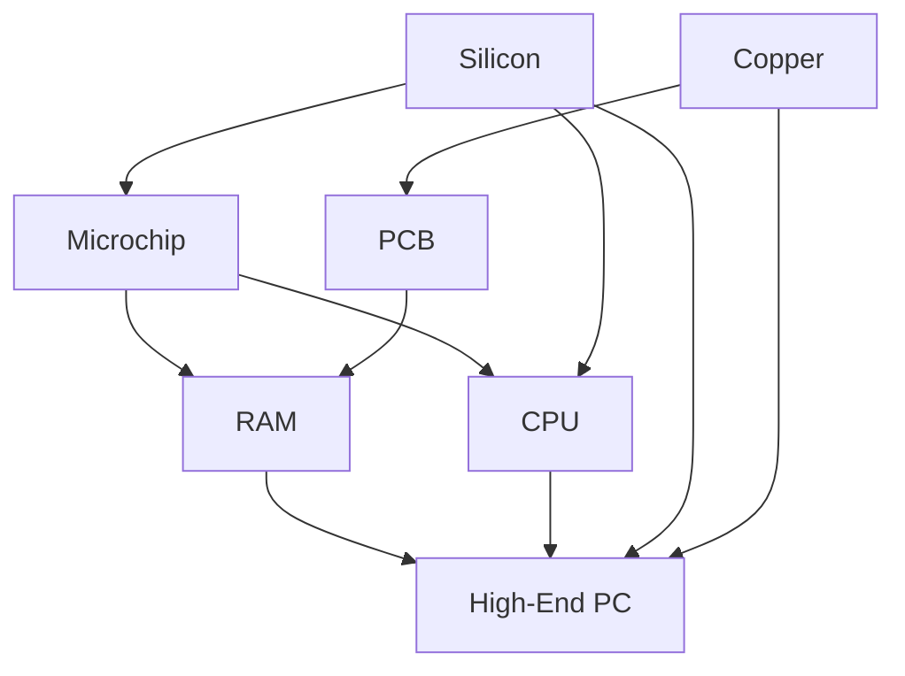

# Dokumentasi Struktur Data: Graph (DAG)
## Proyek: Silicon Forge Tycoon

Dokumen ini menjelaskan implementasi struktur data **Graph** yang digunakan dalam permainan *Silicon Forge Tycoon* untuk mengelola sistem *crafting* dan ketergantungan antar item (*Tech Tree*).

---

### 1. Konsep Dasar
Struktur data yang digunakan adalah **Directed Acyclic Graph (DAG)** atau Graf Berarah Tanpa Siklus.
- **Directed (Berarah)**: Hubungan antar item memiliki arah tertentu (misalnya: Silikon dibutuhkan untuk membuat Microchip, bukan sebaliknya).
- **Acyclic (Tanpa Siklus)**: Tidak ada hubungan yang melingkar. Sebuah item tidak bisa menjadi syarat bagi dirinya sendiri baik secara langsung maupun tidak langsung.

### 2. Implementasi Teknis
Graf ini diimplementasikan menggunakan **Adjacency List** (Daftar Kedekatan) di dalam file `src/logic/Graph.js`.

#### Struktur Data Utama:
- `adjacencyList`: Objek yang menyimpan hubungan antar node. Key adalah ID item, dan value adalah array berisi objek prasyarat (`{ id: prerequisiteId, count: amountRequired }`).
- `nodes`: Objek yang menyimpan metadata item seperti nama, tier, ikon, dan jumlah inventaris saat ini (`inventoryCount`).

### 3. Algoritma Utama

#### A. Penambahan Node dan Edge
- **`addNode(id, metadata)`**: Menambahkan vertex (titik) baru ke dalam graf.
- **`addEdge(fromId, toId, count)`**: Membuat sisi berarah dari `fromId` ke `toId`. Ini merepresentasikan bahwa `toId` membutuhkan `fromId` sebanyak `count`.

#### B. Validasi Crafting dengan DFS
Algoritma yang paling krusial adalah **Depth-First Search (DFS)** yang diimplementasikan dalam metode `validateCraft`.

**Cara Kerja DFS di Sini:**
1. Dimulai dari item yang ingin dibuat (target node).
2. Algoritma menelusuri setiap prasyarat (dependency) secara mendalam.
3. Menggunakan rekursi untuk mengunjungi "anak dari anak" (misalnya: PC -> CPU -> Microchip -> Silicon).
4. **Kompleksitas Waktu**: $O(V + E)$, di mana $V$ adalah jumlah item (Vertex) dan $E$ adalah jumlah hubungan (Edge). Ini memastikan pengecekan tetap cepat meskipun pohon teknologi menjadi sangat besar.

### 4. Contoh Visual Hubungan (Tech Tree)
Berdasarkan kode di `App.jsx`, hubungan yang terbentuk adalah:

### 5. Mengapa Menggunakan Graph?
1. **Fleksibilitas**: Sangat mudah untuk menambah atau mengubah resep *crafting* tanpa mengubah logika inti.
2. **Skalabilitas**: Struktur ini memungkinkan penanganan dependensi yang sangat kompleks secara efisien.
3. **Visualisasi Log**: Karena menggunakan DFS, kita bisa menampilkan proses "berpikir" sistem di terminal log aplikasi saat mengecek ketersediaan bahan.

---
*Dibuat untuk tugas Struktur Data - 2026*
